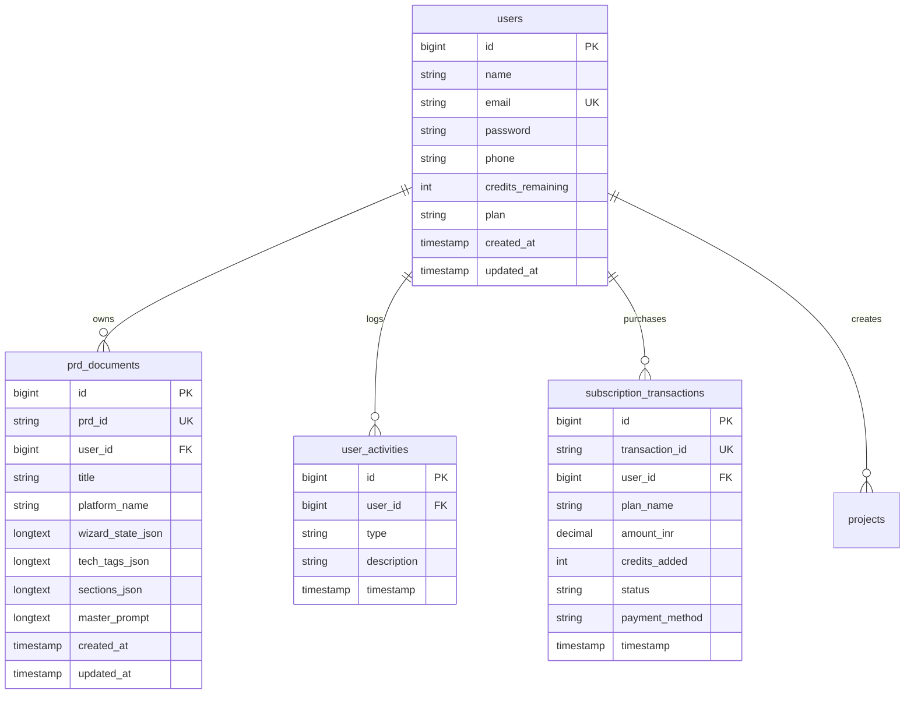

# 📚 PRD Studio - Full Technical Architecture & System Documentation

Welcome to the comprehensive technical documentation for **PRD Studio** (AI PRD Generation SaaS Platform). This document provides an in-depth architectural blueprint, system specification, database relational schemas, API endpoint reference, component lifecycle flows, AI prompt compilation engine details, and deployment guides.

---

## 📋 Table of Contents

1. [Executive System Summary](#1-executive-system-summary)
2. [High-Level System Architecture](#2-high-level-system-architecture)
3. [Frontend Architecture & Component Guide (React 18 + Vite)](#3-frontend-architecture--component-guide-react-18--vite)
   - [3.1 Entry Point & App Router](#31-entry-point--app-router)
   - [3.2 Page Component Specifications](#32-page-component-specifications)
   - [3.3 Modular UI Components](#33-modular-ui-components)
   - [3.4 Client Services Layer](#34-client-services-layer)
   - [3.5 Design System Tokens & Styling Engine](#35-design-system-tokens--styling-engine)
4. [Backend API Architecture (Laravel 11 REST API)](#4-backend-api-architecture-laravel-11-rest-api)
   - [4.1 Routes & Middleware](#41-routes--middleware)
   - [4.2 Controllers & Logic](#42-controllers--logic)
   - [4.3 Database Schemas & Migrations](#43-database-schemas--migrations)
5. [AI Prompt Compilation Engine](#5-ai-prompt-compilation-engine)
   - [5.1 Synthesized 6 Deep Specification Documents](#51-synthesized-6-deep-specification-documents)
   - [5.2 Master 1-Prompt AI Agent Generator](#52-master-1-prompt-ai-agent-generator)
   - [5.3 Multi-LLM Provider Integration](#53-multi-llm-provider-integration)
6. [Multi-Format Document Export Engine](#6-multi-format-document-export-engine)
7. [Billing, Credit Economy & Subscription Lifecycle](#7-billing-credit-economy--subscription-lifecycle)
8. [Security Controls & OWASP Compliance](#8-security-controls--owasp-compliance)
9. [DevOps, Deployment & Maintenance Guide](#9-devops-deployment--maintenance-guide)

---

## 1. Executive System Summary

**PRD Studio** is a full-stack SaaS platform that automates software product specification. Instead of manually drafting product requirements over days, users navigate an interactive 6-step creation wizard specifying target platform, technology stack, design aesthetics, color schemes, typography, and project descriptions.

The application compiles these inputs into **6 production-ready technical specification documents** and a **Master 1-Prompt AI Agent instruction block** designed for immediate execution in AI coding tools like Antigravity, Cursor, Claude Code, OpenCode, and Windsurf.

---

## 2. High-Level System Architecture

The application adopts a decoupled client-server architecture with dual persistence layers (local storage fallback and remote MySQL API persistence):

```mermaid
graph TB
    subgraph Client Application (React 18 + Vite + TypeScript)
        UI[App Shell & Router]
        Wizard[6-Step Creation Wizard]
        Editor[Live Specification Editor]
        Dashboard[Project & Credit Dashboard]
        Services[Client Services Layer]
        
        UI --> Wizard
        UI --> Editor
        UI --> Dashboard
        Wizard --> Services
        Editor --> Services
        Dashboard --> Services
    end

    subgraph Service Layer (src/services/)
        AI[aiEngine.ts - PRD & Master Prompt Synthesizer]
        API[apiService.ts - Laravel Axios REST Client]
        EXP[exportService.ts - PDF/MD/JSON/TXT Exporters]
        STO[storageService.ts - LocalStorage Fallback]
        
        Services --> AI
        Services --> API
        Services --> EXP
        Services --> STO
    end

    subgraph Backend Server (Laravel 11 REST API)
        Routes[API Routes /api/v1/]
        AuthMiddleware[Sanctum Auth Middleware]
        AuthController[AuthController.php]
        PrdController[PrdController.php]
        
        API -->|HTTP REST / JSON| Routes
        Routes --> AuthMiddleware
        AuthMiddleware --> AuthController
        AuthMiddleware --> PrdController
    end

    subgraph Persistence Layer
        DB[(MySQL Database: aiprd)]
        LS[(Browser LocalStorage)]
        
        AuthController --> DB
        PrdController --> DB
        STO --> LS
    end
```

---

## 3. Frontend Architecture & Component Guide (React 18 + Vite)

### 3.1 Entry Point & App Router
- **`src/main.tsx`**: Initializes the React DOM root (`React.StrictMode`) and mounts `App.tsx`.
- **`src/App.tsx`**: Serves as the central state provider and router manager. Manages:
  - Active page state (`landing`, `wizard`, `editor`, `dashboard`, `upgrade`, `account`, `login`, `about`).
  - Active document state (`currentPRD`).
  - User authentication state (`userProfile`).
  - Dark / Light / System theme state.
  - Custom AI Key configuration state.

---

### 3.2 Page Component Specifications

#### 1. `LandingPage.tsx` (`src/pages/LandingPage.tsx`)
- **Purpose**: Public marketing page to convert visitors into active users.
- **Key Sections**:
  - Hero banner with CTA ("Start Building Free", "Explore Specs").
  - Live interactive demo snippet.
  - Feature highlights grid (Wizard, Master Prompt, Exporters, Multi-LLM).
  - Live Pricing Tier matrix (Free, Starter, Pro, Ultimate).
  - FAQ accordion & Footer navigation.

#### 2. `WizardPage.tsx` (`src/pages/WizardPage.tsx`)
- **Purpose**: Interactive 6-step builder wizard for configuring new PRD projects.
- **Step Breakdown**:
  - **Step 1: Platform Selection**: `webapp`, `mobileapp`, `desktopapp`, `custom`.
  - **Step 2: Tech Stack**: Preset or custom selection for Frontend, Backend, Database.
  - **Step 3: Design Style**: 12 Visual presets (Minimal, Gradient, Glassmorphism, Neumorphism, Corporate, Playful, Dark-Tech, Retro, Brutalist, Material, Flat, Custom).
  - **Step 4: Color Palette**: Solid (Stripe Indigo, Emerald, Crimson, Amber), Gradient (Sunset, Ocean, Cyberpunk), or Custom Hex picker.
  - **Step 5: Font Selection**: Google Fonts options (Inter, Roboto, Outfit, JetBrains Mono, etc.).
  - **Step 6: Description & AI Enhancer**: Project concept description with **"Improve My Idea with AI"** button.
- **Generation Pipeline**: Simulates 7 build stages, consumes 50 credits via `storageService.ts`, and redirects to `PrdEditorPage.tsx`.

#### 3. `PrdEditorPage.tsx` (`src/pages/PrdEditorPage.tsx`)
- **Purpose**: Multi-tab specification viewer, editor, and exporter workspace.
- **Key Features**:
  - Tab navigation for the 6 Deep Specification Documents (PRD, TRD, APP FLOW, UI UX, DATABASE DESIGN, SECURITY).
  - **Master 1-Prompt Generator Bar**: Dropdown selector for AI coding tools (Antigravity, Cursor, Claude Code, OpenCode, Windsurf) with 1-click copy functionality.
  - **Multi-Format Export Dropdown**: Select between Markdown (`.md`), PDF (`.pdf`), JSON (`.json`), or Plain Text (`.txt`).
  - Document title editing and section copy buttons.

#### 4. `DashboardPage.tsx` (`src/pages/DashboardPage.tsx`)
- **Purpose**: Central hub for managing existing projects, monitoring credit balances, and tracking usage metrics.
- **Key Features**:
  - Metric summary cards (Total PRDs, Credits Remaining, Active Subscription Plan).
  - Search bar and platform filter pills.
  - Project card grid with tech tags, platform badges, date created, and quick action buttons (Open Editor, Export, Delete).

#### 5. `AccountPage.tsx` (`src/pages/AccountPage.tsx`)
- **Purpose**: User profile management and custom AI provider API key configuration.
- **Key Features**:
  - Profile details form (Name, Email, Phone, Plan status).
  - Theme mode selector (Light, Dark, System).
  - AI API Key configuration manager (Google Gemini, OpenAI, Claude, DeepSeek).
  - User activity audit log.

#### 6. `UpgradePage.tsx` (`src/pages/UpgradePage.tsx`)
- **Purpose**: Subscription tier upgrade and credit purchase interface.
- **Key Features**:
  - Interactive pricing toggle (Monthly vs Annual with 20% discount).
  - Tier selection cards (Free, Starter, Pro, Ultimate).
  - Simulated payment checkout modal with celebratory confetti feedback (`canvas-confetti`).

#### 7. `LoginPage.tsx` (`src/pages/LoginPage.tsx`)
- **Purpose**: User authentication page.
- **Key Features**:
  - Tabbed interface switching between Login and Registration forms.
  - Integration with Laravel Sanctum API endpoint (`/api/v1/auth/login` and `/api/v1/auth/register`) with local storage fallback.

#### 8. `AboutPage.tsx` (`src/pages/AboutPage.tsx`)
- **Purpose**: Product overview, platform vision, architecture specs, and team details.

---

### 3.3 Modular UI Components

- **`Navbar.tsx`**: Sticky top navigation bar featuring logo badge, active page indicator, credit counter badge, dark/light theme toggle, AI key config modal trigger, and user profile avatar menu.
- **`SidebarNav.tsx`**: Collapsible left sidebar navigation drawer for dashboard, wizard, editor, upgrade, and account routes.
- **`Footer.tsx`**: Shared page footer displaying copyright, github repo link, license info, and system status indicator.
- **`AIKeyModal.tsx`**: Modal interface for selecting AI provider (Gemini, OpenAI, Claude, DeepSeek) and configuring secret API keys.
- **`MenuModal.tsx`**: Responsive mobile drawer menu for navigation on small screen devices.
- **`ErrorBoundary.tsx`**: React component error boundary preventing total app crashes during unexpected runtime errors.

---

### 3.4 Client Services Layer

- **`src/services/aiEngine.ts`**: Pure functions for compiling 6-step wizard state into 6 structured specification documents and synthesizing the Master 1-Prompt instruction block.
- **`src/services/apiService.ts`**: Axios/Fetch client wrapper for executing REST HTTP calls (`GET`, `POST`, `PUT`, `DELETE`) against the backend Laravel 11 API (`/api/v1/`).
- **`src/services/exportService.ts`**: Handles client-side document exports using `jspdf` and `html2canvas` for PDF compilation, file download blob creation for Markdown/JSON/TXT, and clipboard copying.
- **`src/services/storageService.ts`**: Synchronous local storage utility ensuring complete app functionality even when offline or running without a live database.

---

### 3.5 Design System Tokens & Styling Engine

Styling is defined in `src/index.css` using CSS custom properties for dark and light modes:

```css
:root {
  --font-family: 'Inter', system-ui, -apple-system, sans-serif;
  --bg-main: #f8fafc;
  --bg-card: #ffffff;
  --text-primary: #0f172a;
  --text-secondary: #475569;
  --text-muted: #94a3b8;
  --border-color: #e2e8f0;
  --primary: #2563eb;
  --primary-hover: #1d4ed8;
  --primary-light: #eff6ff;
  --shadow-sm: 0 1px 2px 0 rgba(0, 0, 0, 0.05);
  --shadow-card: 0 4px 20px -2px rgba(0, 0, 0, 0.05);
  --radius-card: 16px;
  --radius-btn: 10px;
}

[data-theme='dark'] {
  --bg-main: #090d16;
  --bg-card: #111827;
  --text-primary: #f8fafc;
  --text-secondary: #cbd5e1;
  --text-muted: #64748b;
  --border-color: #1e293b;
  --primary: #3b82f6;
  --primary-hover: #60a5fa;
  --primary-light: rgba(59, 130, 246, 0.15);
}
```

---

## 4. Backend API Architecture (Laravel 11 REST API)

### 4.1 Routes & Middleware

Routes are registered in `backend/routes/api.php` under the `/v1` prefix:

```php
Route::prefix('v1')->group(function () {
    // Unauthenticated Public Routes
    Route::post('/auth/register', [AuthController::class, 'register']);
    Route::post('/auth/login', [AuthController::class, 'login']);
    Route::get('/healthz', function () {
        return response()->json([
            'status' => 'ok',
            'service' => 'Laravel 11 API Backend (MySQL aiprd)',
            'timestamp' => now()->toIso8601String(),
        ]);
    });

    // Authenticated Routes (Laravel Sanctum Token Verification)
    Route::middleware('auth:sanctum')->group(function () {
        Route::get('/auth/me', [AuthController::class, 'me']);
        Route::post('/auth/logout', [AuthController::class, 'logout']);

        Route::get('/prds', [PrdController::class, 'index']);
        Route::post('/prds/generate', [PrdController::class, 'generate']);
        Route::get('/prds/{id}', [PrdController::class, 'show']);
        Route::put('/prds/{id}', [PrdController::class, 'updateSection']);
        Route::delete('/prds/{id}', [PrdController::class, 'destroy']);
    });
});
```

---

### 4.2 Controllers & Logic

1. **`AuthController.php`** (`backend/app/Http/Controllers/AuthController.php`):
   - Handles user registration, validates credentials, issues Sanctum bearer tokens, and manages authentication sessions.
2. **`PrdController.php`** (`backend/app/Http/Controllers/PrdController.php`):
   - Manages PRD CRUD operations, serializes wizard state into `JSON` columns, deducts credits, and returns document responses.

---

### 4.3 Database Schemas & Migrations

The MySQL database (`aiprd`) contains 6 core relational tables:



---

## 5. AI Prompt Compilation Engine

### 5.1 Synthesized 6 Deep Specification Documents

When the wizard is executed, `generatePRDDocument(state)` synthesizes 6 specification files:

1. **PRD (Product Requirements Document)**: Project name, platform, primary goals, problem statement, personas, and P0/P1 feature breakdown.
2. **TRD (Technical Requirements Document)**: Frontend framework, backend framework, database engine, server architecture, component state management.
3. **APP FLOW (User Journeys & Route Progression)**: Route map (`/`, `/login`, `/dashboard`, `/wizard`, `/editor`, `/upgrade`, `/account`), step-by-step user journeys.
4. **UI UX (Design System Tokens)**: Aesthetic style, palette specs, primary/secondary accents, font family, button/card component guidelines.
5. **DATABASE DESIGN (MySQL Schemas & ERD)**: Table definitions (`users`, `prd_documents`, etc.), column data types, key constraints, Eloquent mapping.
6. **SECURITY (Auth, OWASP Controls)**: Laravel Sanctum bearer tokens, bcrypt password hashing, SQL injection prevention (PDO), CSRF/XSS controls, API rate limiting.

---

### 5.2 Master 1-Prompt AI Agent Generator

Synthesizes a single instruction block formatted specifically for AI coding agents:

```text
MASTER 1-PROMPT AI AGENT INSTRUCTION – [PROJECT TITLE]
Target AI Coding Tools: Cursor, Claude Code, Antigravity, OpenCode, Windsurf

BUILD THIS COMPLETE SYSTEM FROM SCRATCH IN ONE PROMPT:
1. APPLICATION OVERVIEW: [Title] for [Platform]. [Description]
2. EXACT TECH STACK: [Frontend] + [Backend] + [Database] + [Style] + [Font].
3. REQUIRED MODULES & BUTTONS FROM SCRATCH: Auth, Dashboard, Wizard, Database, Security.
Implement all components, routes, database migrations, models, controllers, and styling cleanly with no missing imports!
```

---

### 5.3 Multi-LLM Provider Integration

Users can plug in secret keys for 4 supported AI model providers:
- **Google Gemini API**: `gemini-1.5-pro`, `gemini-1.5-flash`
- **OpenAI GPT-4**: `gpt-4o`, `gpt-4-turbo`
- **Anthropic Claude**: `claude-3-5-sonnet`
- **DeepSeek**: `deepseek-coder`, `deepseek-chat`

---

## 6. Multi-Format Document Export Engine

Document exports are handled by `src/services/exportService.ts`:
- **Markdown Export (`.md`)**: Assembles all 6 sections with `#` header tags and code blocks into a `.md` Blob trigger.
- **PDF Export (`.pdf`)**: Uses `html2canvas` to render the document DOM element into a canvas object, then uses `jspdf` to compile a multi-page PDF document.
- **JSON Export (`.json`)**: Serializes the `PRDDocument` data object into formatted JSON string.
- **Text Export (`.txt`)**: Generates plain-text output with ASCII section separators.

---

## 7. Billing, Credit Economy & Subscription Lifecycle

- **Credit Cost**: 50 credits per PRD compilation.
- **Default Credits**: Every new user receives **50 Free Credits**.
- **Subscription Tiers**:
  - **Free Tier**: 50 credits (₹0)
  - **Starter Tier**: 500 credits (₹1,499 / month)
  - **Pro Tier**: 2,000 credits (₹3,999 / month)
  - **Ultimate Tier**: 10,000 credits (₹7,999 / month)
- **Transaction Audit**: Payment purchases record transaction logs in `subscription_transactions` and issue celebratory confetti feedback via `canvas-confetti`.

---

## 8. Security Controls & OWASP Compliance

1. **Authentication Security**: Token sessions managed by **Laravel Sanctum**. Passwords encrypted using **bcrypt** (cost factor 12).
2. **SQL Injection Prevention**: All database queries executed via **Laravel Eloquent ORM** using prepared PDO statements.
3. **XSS Protection**: HTML inputs sanitized; React automatically escapes JSX string variables.
4. **CSRF Protection**: Token verification enforced on state-changing HTTP requests.
5. **Rate Limiting**: API routes throttled to 60 requests per minute per IP address.

---

## 9. DevOps, Deployment & Maintenance Guide

### Local Development Setup

```bash
# 1. Start MySQL Server (Create database 'aiprd')
# 2. Setup Backend API
cd backend
composer install
cp .env.example .env
php artisan key:generate
php artisan migrate
php artisan serve --port=8000

# 3. Setup Frontend App
cd promptgenerator
npm install
npm run dev
```

### Production Deployment Strategy

1. **Frontend (Vite Build)**:
   ```bash
   npm run build
   ```
   Deploy static contents of `dist/` to **Vercel**, **Netlify**, or an **Nginx** web server.

2. **Backend (Laravel 11)**:
   Set `.env` parameters:
   ```env
   APP_ENV=production
   APP_DEBUG=false
   APP_URL=https://api.yourdomain.com
   ```
   Optimize Laravel performance:
   ```bash
   php artisan config:cache
   php artisan route:cache
   php artisan view:cache
   ```

---

*PRD Studio Technical Architecture Documentation v1.0.0 — Created with ❤️ by Amit B Makwana*
