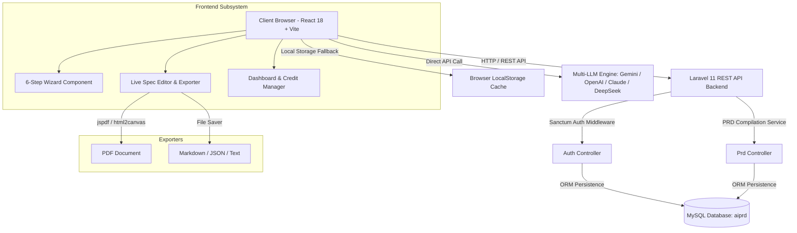

# 🚀 PRD Studio - Enterprise AI PRD Generation SaaS Platform

[](https://react.dev/)
[](https://vitejs.dev/)
[](https://www.typescriptlang.org/)
[](https://laravel.com/)
[](https://www.mysql.com/)
[](LICENSE)

**PRD Studio** is an enterprise-grade, full-stack AI-powered SaaS application designed to empower product managers, software engineers, technical founders, and agency leads to create, refine, compile, export, and manage complete Product Requirement Documents (PRDs) and Technical Specification Files in seconds.

Built with a **React 18 + Vite + TypeScript** single-page application frontend and a robust **Laravel 11 REST API** backend connected to a **MySQL** database (`aiprd`), PRD Studio provides an end-to-end suite featuring an interactive 6-step creation wizard, live section editing, multi-format export capability (PDF, Markdown, HTML, JSON, TXT), master AI prompt generation for coding agents (Cursor, Claude Code, Antigravity, OpenCode, Windsurf), and credit-based subscription billing.

---

## 📖 Table of Contents

- [🌟 Features & Capabilities](#-features--capabilities)
- [🏗️ High-Level System Architecture](#️-high-level-system-architecture)
- [💻 Tech Stack Matrix](#-tech-stack-matrix)
- [📁 Directory Structure](#-directory-structure)
- [⚙️ Prerequisites](#️-prerequisites)
- [🚀 Step-by-Step Setup Guide](#-step-by-step-setup-guide)
  - [1. Database Initialization](#1-database-initialization)
  - [2. Backend Setup (Laravel 11 API)](#2-backend-setup-laravel-11-api)
  - [3. Frontend Setup (React + Vite)](#3-frontend-setup-react--vite)
- [📊 Database Schemas](#-database-schemas)
- [📡 RESTful API Documentation](#-restful-api-documentation)
- [🤖 AI Engine & Multi-LLM Key Setup](#-ai-engine--multi-llm-key-setup)
- [📄 Multi-Format Export Engine](#-multi-format-export-engine)
- [💳 Credit System & Subscription Tiers](#-credit-system--subscription-tiers)
- [🛠️ Production Build & Deployment](#️-production-build--deployment)
- [📄 License & Authors](#-license--authors)

---

## 🌟 Features & Capabilities

### 🪄 1. Interactive 6-Step PRD Generation Wizard
- **Step 1: Target Platform Selection**: Web App, Mobile App (iOS/Android), Desktop App (Windows/Mac), Custom Extension/CLI/Game.
- **Step 2: Tech Stack Configuration**: Flexible presets and custom stack builder for Frontend (React, Next.js, Vue, Angular, Flutter, Electron), Backend (Node.js, Laravel, Python FastAPI, Go, Java), and Database (PostgreSQL, MySQL, MongoDB, SQLite).
- **Step 3: Design Style & Aesthetics**: 12+ curated design system presets including Minimalist, Gradient, Glassmorphism, Neumorphism, Corporate, Playful, Dark-Tech, Retro, Brutalist, Material, and Flat.
- **Step 4: Color Palette Customization**: Solid color presets (Stripe Indigo, Emerald, Crimson, Amber), Gradient presets (Sunset, Ocean, Cyberpunk), and full custom HEX pickers (Primary, Secondary, Accent, Background, Surface, Text).
- **Step 5: Typography & Font Selection**: Curated Google Fonts options (Inter, Roboto, Outfit, JetBrains Mono, Plus Jakarta Sans, Fira Code, Poppins).
- **Step 6: Project Concept & Prompt Assistance**: Instant template pickers, custom project details, and an **"Improve My Idea with AI"** prompt enhancer.

### 📝 2. Comprehensive Specification Workspace
Every generated project includes **6 Deep Specification Files**:
1. **PRD (Product Requirements Document)**: Executive Summary, Target Personas, Problem Statement, P0/P1 Feature Specifications.
2. **TRD (Technical Requirements Document)**: Framework choices, system infrastructure, state management, API routes, performance standards.
3. **APP FLOW (User Journeys & Screen Maps)**: Screen route mappings, step-by-step route progression, error handling states.
4. **UI UX (Design System Tokens & Wireframes)**: Theme specs, exact Hex color tokens, button/card component standards, font rules.
5. **DATABASE DESIGN (MySQL Schemas & ERD)**: Table definitions (`users`, `prd_documents`), data types, primary/foreign key relationships, indexes.
6. **SECURITY (Auth, OWASP Controls & Rate Limiting)**: Laravel Sanctum bearer token auth, bcrypt hashing, CSRF/XSS protection, rate limiting.

### 🤖 3. Master 1-Prompt AI Agent Generator
- Generates a single, ready-to-copy instruction set formatted specifically for AI coding agents such as **Antigravity**, **Cursor**, **Claude Code**, **OpenCode**, and **Windsurf**.
- Synthesizes all 6 specification documents into a master instruction block to build the entire app from scratch.

### 📥 4. Multi-Format Document Export Engine
- **PDF Export (`.pdf`)**: High-fidelity formatted PDF generated via `jspdf` and `html2canvas`.
- **Markdown Export (`.md`)**: GitHub-flavored markdown export.
- **JSON Export (`.json`)**: Raw structured JSON containing wizard state, tech tags, section breakdown, and timestamps.
- **Text Export (`.txt`)**: Clean plain-text formatted output.

### 📊 5. Dashboard & Project Management
- Real-time project list with filterable search and sorting.
- Activity metrics (total PRDs generated, credits remaining, current plan status).
- Quick actions to open, edit, export, or delete saved PRDs.

### 💳 6. Subscription Tiers & Credit Engine
- Credit consumption model (50 credits per PRD compilation).
- Plan options: **Free** (50 credits), **Starter** ($19 / 500 credits), **Pro** ($49 / 2,000 credits), **Ultimate** ($99 / 10,000 credits).
- Interactive simulated payment workflow with celebratory confetti UI feedback.

---

## 🏗️ High-Level System Architecture



---

## 💻 Tech Stack Matrix

| Layer | Technology | Description |
| :--- | :--- | :--- |
| **Frontend Framework** | React 18.3.1 (TypeScript) | Single-page UI application with reactive hooks |
| **Build Tool & Server** | Vite 5.2.0 | Ultra-fast HMR bundler and development server |
| **Styling Engine** | Vanilla CSS Design System | Custom CSS variables, glassmorphism, responsive grid |
| **Icons & UI Extras** | Lucide React, Canvas Confetti | Modern icon suite and interactive celebration UI |
| **Export Utilities** | `jspdf`, `html2canvas` | PDF compilation and document rendering |
| **Backend Framework** | Laravel 11.x (PHP 8.2+) | Enterprise RESTful API backend framework |
| **Authentication** | Laravel Sanctum | Bearer token session authentication |
| **Database Engine** | MySQL 8.0+ | Relational database (`aiprd`) with Eloquent ORM |

---

## 📁 Directory Structure

```
prdstudio/
├── src/                                  # React Frontend Application Root
│   ├── assets/                           # Static media, logos, and graphic assets
│   ├── components/                       # Modular UI Components
│   │   ├── AIKeyModal.tsx                # Custom API key modal for Multi-LLM selection
│   │   ├── ErrorBoundary.tsx             # Global React error boundary component
│   │   ├── Footer.tsx                    # Shared page footer with links & status indicator
│   │   ├── MenuModal.tsx                 # Mobile responsive navigation drawer
│   │   ├── Navbar.tsx                    # Top navigation header with user profile menu
│   │   └── SidebarNav.tsx                # Layout sidebar navigation for dashboard/editor
│   ├── pages/                            # Application View Pages
│   │   ├── AboutPage.tsx                 # Product story, mission, and team specs
│   │   ├── AccountPage.tsx               # User profile, API keys, and activity log
│   │   ├── DashboardPage.tsx             # Project dashboard & search filtering
│   │   ├── LandingPage.tsx               # Public marketing landing page with hero & pricing
│   │   ├── LoginPage.tsx                 # User authentication (Login / Registration tab switcher)
│   │   ├── PrdEditorPage.tsx             # Interactive PRD editor & exporter workspace
│   │   ├── UpgradePage.tsx               # Credit purchase & plan tier selection
│   │   └── WizardPage.tsx                # 6-Step interactive PRD creation wizard
│   ├── services/                         # Client Logic & API Services
│   │   ├── aiEngine.ts                   # Specification generator & master prompt builder
│   │   ├── apiService.ts                 # Axios/Fetch client connecting to Laravel API
│   │   ├── exportService.ts              # PDF, Markdown, JSON, and Text export handlers
│   │   └── storageService.ts             # Browser local storage persistence fallback
│   ├── types/                            # TypeScript Data Contracts
│   │   └── prd.ts                        # Interfaces for WizardState, PRDDocument, UserProfile, etc.
│   ├── App.tsx                           # Main React router & global state provider
│   ├── main.tsx                          # React DOM initialization entrypoint
│   └── index.css                         # Design system tokens, utilities & themes
├── backend/                              # Laravel 11 REST API Backend Root
│   ├── app/
│   │   ├── Http/Controllers/
│   │   │   ├── AuthController.php        # User registration, login, logout, me endpoints
│   │   │   └── PrdController.php         # PRD CRUD operations & generation endpoints
│   │   ├── Models/
│   │   │   ├── User.php                  # User model with Sanctum HasApiTokens
│   │   │   ├── Project.php               # Project entity model
│   │   │   ├── PrdDocument.php           # PRD Document model storing JSON state
│   │   │   ├── UserActivity.php          # Audit log history model
│   │   │   └── SubscriptionTransaction.php # Payment transaction model
│   ├── config/                           # Laravel app, CORS, database configs
│   ├── database/
│   │   ├── migrations/                   # 6 Database migrations for MySQL schema setup
│   │   └── seeders/                      # Database demo seeders
│   ├── routes/
│   │   └── api.php                       # Versioned REST API endpoints (`/api/v1/`)
│   ├── composer.json                     # PHP dependencies specification
│   └── artisan                           # Laravel CLI executable
├── DOCUMENTATION.md                      # Comprehensive Architecture Documentation
├── index.html                            # Single Page App HTML container
├── package.json                          # Node.js dependencies & scripts
├── tsconfig.json                         # TypeScript compiler rules
├── vite.config.ts                        # Vite bundler options
└── README.md                             # Project readme documentation
```

---

## ⚙️ Prerequisites

Ensure your development environment meets the following requirements:

1. **Node.js**: `v18.0.0` or `v20.0.0+` with `npm v9.0.0+`
2. **PHP**: `v8.2` or higher with pdo, pdo_mysql, and mbstring extensions
3. **Composer**: `v2.5.0+`
4. **MySQL Database**: `v8.0+` (via XAMPP, WAMP, DBngin, Docker, or native installer)

---

## 🚀 Step-by-Step Setup Guide

### 1. Database Initialization

1. Start your local MySQL database server.
2. Open your MySQL terminal or client (phpMyAdmin, TablePlus, DBeaver) and create the database:

```sql
CREATE DATABASE aiprd CHARACTER SET utf8mb4 COLLATE utf8mb4_unicode_ci;
```

---

### 2. Backend Setup (Laravel 11 API)

1. Open your terminal and navigate into the `backend/` directory:

```bash
cd backend
```

2. Install the required PHP dependencies via Composer:

```bash
composer install
```

3. Create the `.env` configuration file:

```bash
cp .env.example .env
```

4. Configure your database credentials in `backend/.env`:

```env
APP_NAME="PRD Studio API"
APP_ENV=local
APP_KEY=
APP_DEBUG=true
APP_URL=http://localhost:8000

DB_CONNECTION=mysql
DB_HOST=127.0.0.1
DB_PORT=3306
DB_DATABASE=aiprd
DB_USERNAME=root
DB_PASSWORD=
```

5. Generate the application encryption key:

```bash
php artisan key:generate
```

6. Execute database schema migrations:

```bash
php artisan migrate
```

*(Optional)* Seed demo data:

```bash
php artisan db:seed
```

7. Launch the Laravel development server:

```bash
php artisan serve --port=8000
```

> 🟢 **Backend API URL**: `http://127.0.0.1:8000/api/v1`  
> 🧪 **API Healthcheck**: `http://127.0.0.1:8000/api/v1/healthz`

---

### 3. Frontend Setup (React + Vite)

1. Open a second terminal window and navigate to the project root:

```bash
cd promptgenerator
```

2. Install Node.js dependencies:

```bash
npm install
```

3. Start the Vite development server:

```bash
npm run dev
```

4. Open your web browser and navigate to:

> 🌐 **App URL**: `http://localhost:5173`

---

## 📊 Database Schemas

PRD Studio uses a clean relational MySQL schema (`aiprd` database):

### 1. `users` Table
| Field | Type | Constraints | Description |
| :--- | :--- | :--- | :--- |
| `id` | `BIGINT UNSIGNED` | Primary Key, Auto Increment | Unique user ID |
| `name` | `VARCHAR(255)` | NOT NULL | User full name |
| `email` | `VARCHAR(255)` | UNIQUE, NOT NULL | User login email |
| `password` | `VARCHAR(255)` | NOT NULL | Bcrypt hashed password |
| `phone` | `VARCHAR(255)` | NULLABLE | Contact telephone |
| `credits_remaining` | `INT` | DEFAULT 50 | Remaining PRD compilation credits |
| `plan` | `VARCHAR(50)` | DEFAULT 'Free' | Active subscription tier |
| `created_at` | `TIMESTAMP` | NULLABLE | Record creation timestamp |
| `updated_at` | `TIMESTAMP` | NULLABLE | Record last update timestamp |

### 2. `prd_documents` Table
| Field | Type | Constraints | Description |
| :--- | :--- | :--- | :--- |
| `id` | `BIGINT UNSIGNED` | Primary Key, Auto Increment | Internal primary key |
| `prd_id` | `VARCHAR(100)` | UNIQUE, NOT NULL | Public string UUID (`prd-123...`) |
| `user_id` | `BIGINT UNSIGNED` | Foreign Key -> `users.id` | Document owner |
| `title` | `VARCHAR(255)` | NOT NULL | Project title |
| `platform_name` | `VARCHAR(100)` | NOT NULL | Selected target platform |
| `wizard_state_json` | `LONGTEXT` | NOT NULL | JSON stringified 6-step state |
| `tech_tags_json` | `LONGTEXT` | NOT NULL | JSON array of stack tags |
| `sections_json` | `LONGTEXT` | NOT NULL | JSON array of 6 spec sections |
| `master_prompt` | `LONGTEXT` | NOT NULL | Master 1-Prompt instruction block |

---

## 📡 RESTful API Documentation

Base Endpoint: `http://localhost:8000/api/v1`

| Method | Route | Auth Required | Description |
| :--- | :--- | :--- | :--- |
| `POST` | `/auth/register` | No | Register a new user profile |
| `POST` | `/auth/login` | No | Authenticate user & receive Sanctum token |
| `GET` | `/healthz` | No | Healthcheck API status endpoint |
| `GET` | `/auth/me` | **Yes** | Fetch active authenticated user profile |
| `POST` | `/auth/logout` | **Yes** | Revoke current access token |
| `GET` | `/prds` | **Yes** | Fetch all saved PRDs for current user |
| `POST` | `/prds/generate` | **Yes** | Compile wizard state into new PRD document |
| `GET` | `/prds/{id}` | **Yes** | Fetch single PRD document by ID |
| `PUT` | `/prds/{id}` | **Yes** | Update PRD section content or project title |
| `DELETE` | `/prds/{id}` | **Yes** | Remove PRD document from database |

---

## 🤖 AI Engine & Multi-LLM Key Setup

PRD Studio supports **4 major AI Providers**:
1. **Google Gemini API** (`gemini-1.5-pro` / `gemini-1.5-flash`)
2. **OpenAI GPT-4** (`gpt-4o` / `gpt-4-turbo`)
3. **Anthropic Claude 3.5** (`claude-3-5-sonnet`)
4. **DeepSeek** (`deepseek-coder` / `deepseek-chat`)

### Adding Custom API Key in App:
1. Click the **API Key** button in the navbar header.
2. Select your preferred provider.
3. Paste your secret key and click **Save Key**. Keys are stored securely in encrypted browser state and local storage.

---

## 📄 Multi-Format Export Engine

PRD Studio allows downloading documents in 4 formats directly from the editor workspace:
- **Markdown (`.md`)**: Perfect for committing directly to GitHub repositories or documentation wikis.
- **PDF Document (`.pdf`)**: Formatted document output suitable for client presentations.
- **JSON File (`.json`)**: Full raw schema payload for backup and system migrations.
- **Text File (`.txt`)**: Plain text output for fast offline viewing.

---

## 💳 Credit System & Subscription Tiers

| Plan Tier | Price (INR) | Included Credits | Validity | Features Included |
| :--- | :--- | :--- | :--- | :--- |
| **Free** | ₹0 / forever | 50 credits | Lifetime | 1 PRD generation, standard Markdown export |
| **Starter** | ₹1,499 / mo | 500 credits | 30 days | 10 PRD generations, PDF/MD/JSON exports, standard support |
| **Pro** (Popular) | ₹3,999 / mo | 2,000 credits | 30 days | 40 PRD generations, Master 1-Prompt compiler, priority queue |
| **Ultimate** | ₹7,999 / mo | 10,000 credits | 30 days | Unlimited generations, custom API keys, dedicated support |

---

## 🛠️ Production Build & Deployment

To build the React application for production deployment:

```bash
npm run build
```

This compiles TypeScript and bundle assets into the `dist/` directory, optimized for hosting on **Vercel**, **Netlify**, **Nginx**, or **Apache**.

For production Laravel backend deployment:
1. Set `APP_ENV=production` and `APP_DEBUG=false` in `backend/.env`.
2. Run `php artisan config:cache`, `php artisan route:cache`, and `php artisan view:cache`.
3. Point your web server root to `backend/public`.

---

## 📄 License & Authors

- **Author**: [Amit B Makwana](https://github.com/AmitBMakwana)
- **Repository**: [https://github.com/AmitBMakwana/prdstudio.git](https://github.com/AmitBMakwana/prdstudio.git)
- **License**: Released under the [MIT License](LICENSE).